# Component Hierarchy and Data Flow Diagrams

## Three-Tier Component Architecture

### Tier 1: MapLibre GL JS (2D Primary Interface)

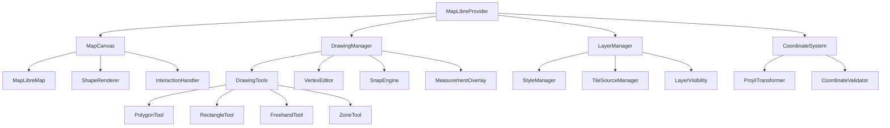

### Tier 2: Babylon.js + Mapbox (General 3D Visualization)

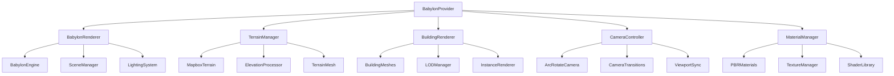

### Tier 3: Three.js (Hyper-Focused Site View)

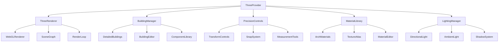

## Unified Data Flow Architecture

### Data Pipeline Overview

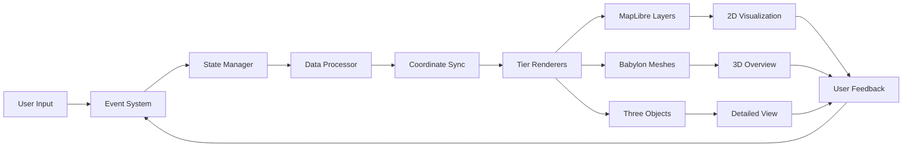

### State Management Flow

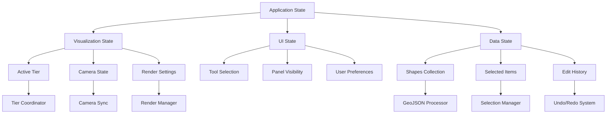

## Integration Patterns

### Cross-Tier Communication

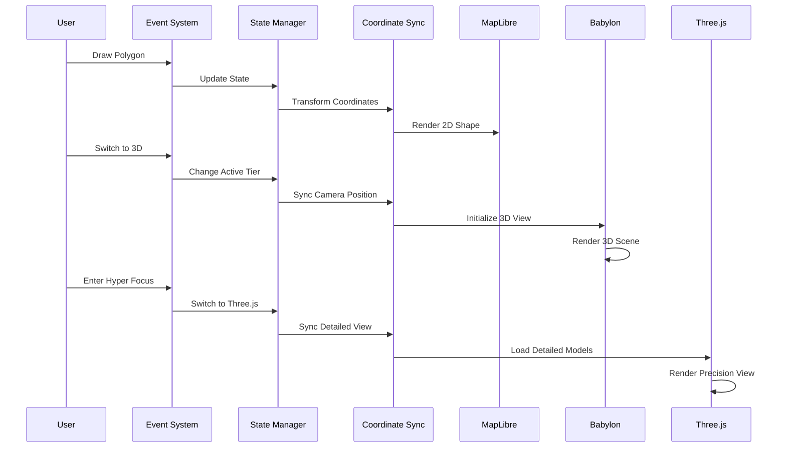

### Data Transformation Pipeline

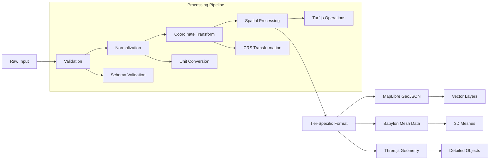

## Component Interaction Patterns

### Event Flow Architecture

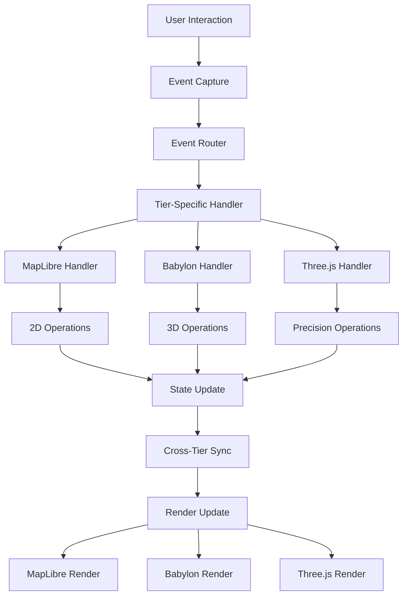

### Memory Management Flow

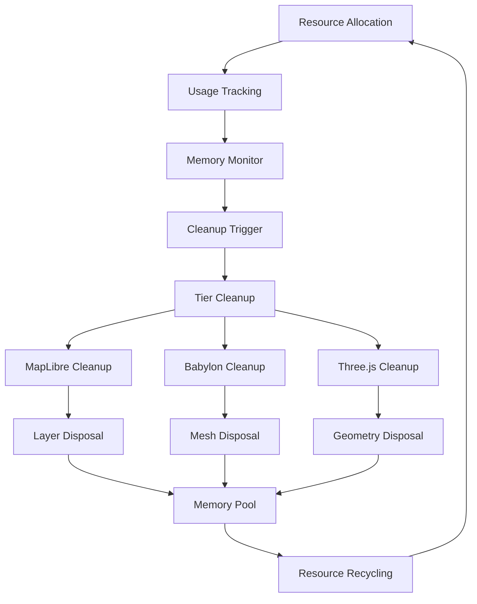

## Performance Optimization Patterns

### Lazy Loading Strategy

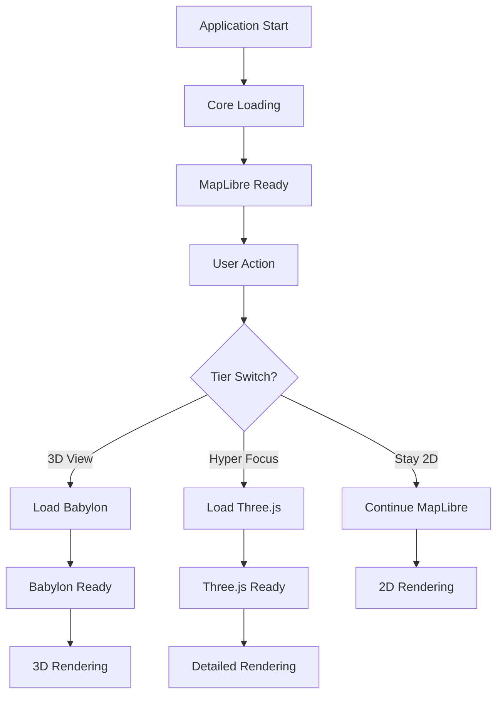

### Caching Architecture

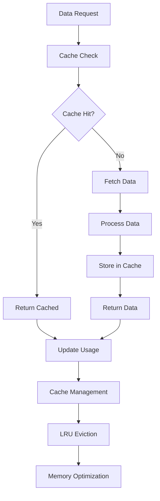

## Migration Component Mapping

### Current to New Component Mapping

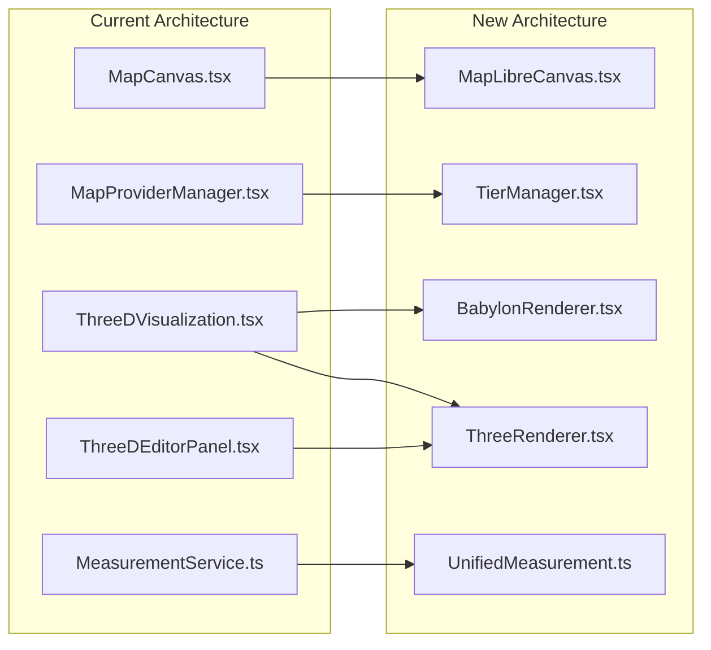

### Data Structure Evolution

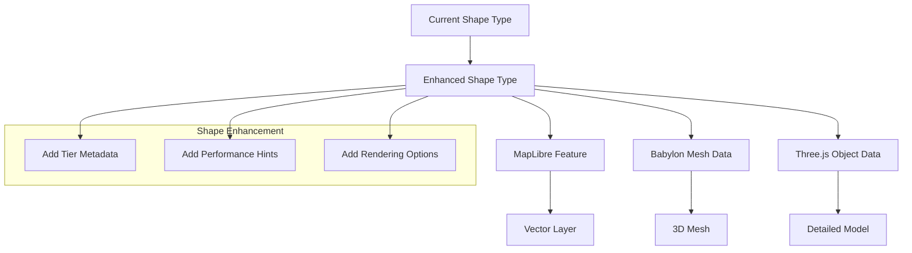

## Testing Architecture

### Component Testing Strategy

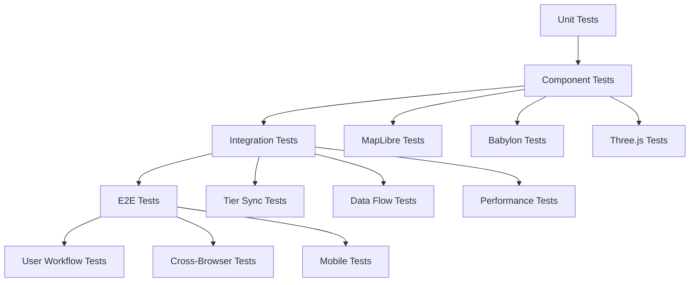

### Performance Testing Flow

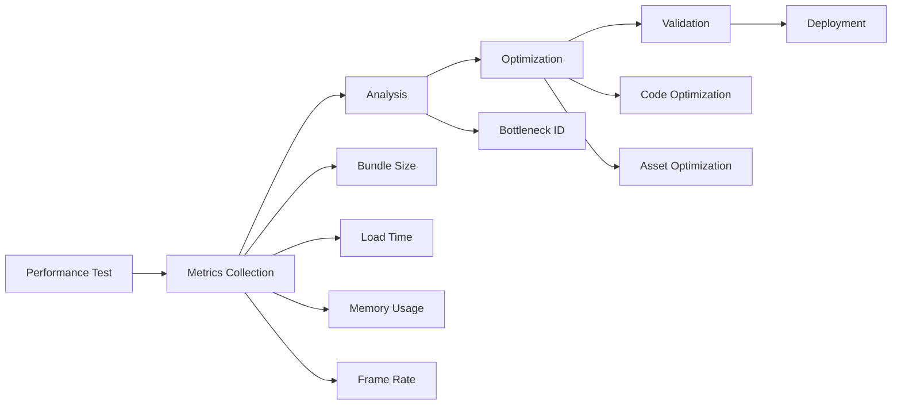

## Implementation Phases

### Phase 1: MapLibre Foundation

### Phase 2: Babylon.js Integration

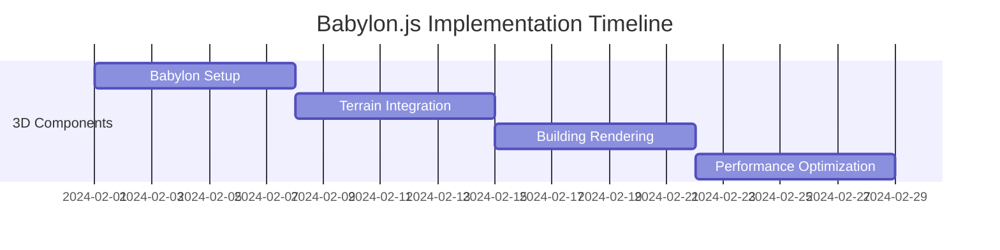

### Phase 3: Three.js Hyper-Focus

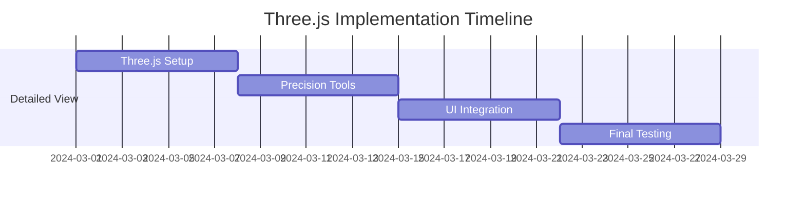

This component hierarchy and data flow architecture provides a clear roadmap for implementing the three-tier visualization system while maintaining clean separation of concerns and efficient data flow between all components.
