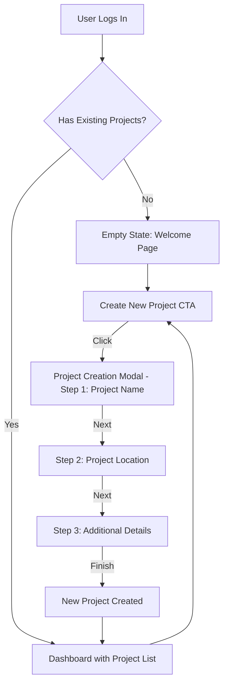

# New Project Creation: User Flow and UI Mockups

This document outlines the user flow, UI mockups, and technical implementation plan for the "New Project" creation process.

## 1. User Flow Diagram

The following diagram illustrates the user flow for creating a new project, covering both the empty state (first-time user) and the existing projects state.

## 2. UI Mockups

### 2.1. Empty State (First-Time User)

- **Location:** `src/app/welcome/page.tsx`
- **Description:** A clean, welcoming page with a prominent "Create New Project" button. This will be the primary call-to-action for new users.

### 2.2. Existing Projects State

- **Location:** `src/app/page.tsx`
- **Description:** The main dashboard, displaying a grid or list of existing projects using the `ProjectCard` component. A "Create New Project" button will be clearly visible, likely in the header or as a floating action button.

### 2.3. Project Creation Modal

A multi-step modal will guide the user through the project creation process.

- **Step 1: Project Name:** A simple form with a single text input for the project name.
- **Step 2: Project Location:** An interactive map (e.g., Mapbox) allowing the user to search for an address, drop a pin, or enter coordinates.
- **Step 3: Additional Details:** A form for capturing additional project information, such as project type, area size, and start date.

### 2.4. Updated Project Card

The existing `ProjectCard` component will be updated to include a dedicated space for the project's location.

- **File:** `src/components/welcome/project-card.tsx`
- **Enhancement:** A new field will be added to the card to display the project's location (e.g., "City, State/Country").

## 3. Technical Implementation Plan

The following is a high-level technical plan for implementing the new project creation flow.

### 3.1. Create New Components

- **`CreateProjectModal.tsx`**: A new component to manage the multi-step project creation process. This will be located in `src/components/project/`.
- **`ProjectNameStep.tsx`**: A component for the first step of the modal, capturing the project name.
- **`ProjectLocationStep.tsx`**: A component for the second step, integrating a map for location selection.
- **`ProjectDetailsStep.tsx`**: A component for the final step, with a form for additional project details.

### 3.2. Update Existing Pages

- **`src/app/welcome/page.tsx`**: Add the "Create New Project" button and logic to open the `CreateProjectModal`.
- **`src/app/page.tsx`**: Add the "Create New Project" button and logic to open the `CreateProjectModal`.

### 3.3. Modify `ProjectCard` Component

- **`src/components/welcome/project-card.tsx`**: Update the component to display the project's location.

This plan provides a clear path forward for implementing the new project creation flow.
