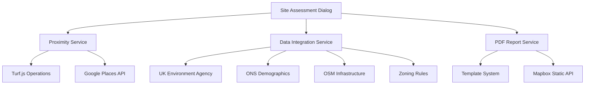
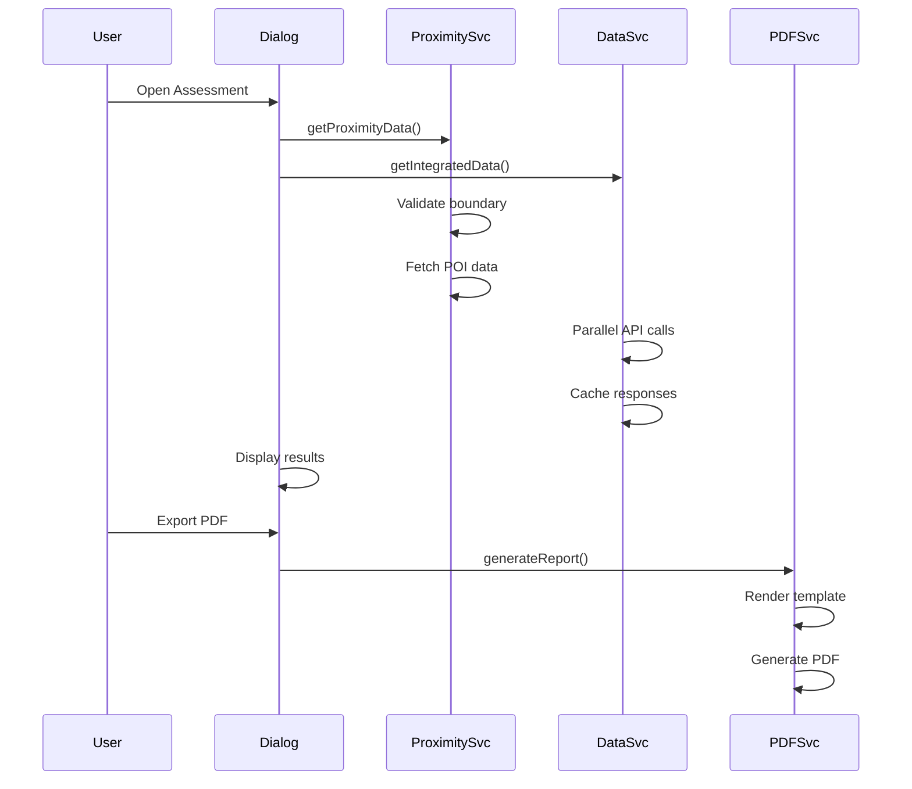

# Enhanced Site Assessment Report System

This document outlines the comprehensive enhancements made to the Site Assessment Report functionality, including improved proximity analysis, additional data sources, enhanced PDF export, and technical optimizations.

## 1. System Architecture Overview

## 2. Core Enhancements

### 2.1. Proximity Analysis Service (`src/services/proximity-service.ts`)

**Features:**

- Robust POI distance calculations for schools, hospitals, highways, airports, towns
- Boundary validation using Turf.js kinks detection
- Irregular polygon handling with nearest point calculations
- Google Places API integration with error handling
- Parallel POI fetching for improved performance

**Key Functions:**

- `getProximityData()`: Main service function with comprehensive validation
- Boundary validation using `turf.kinks()` for self-intersection detection
- Distance calculations with boundary-aware nearest point logic

### 2.2. Data Integration Service (`src/services/data-integrator-service.ts`)

**Data Sources:**

- **Environmental**: Environment Agency flood risk, Magic soil quality analysis
- **Demographic**: ONS population, density, age, and income data
- **Infrastructure**: OSM rail transport and utility availability
- **Regulatory**: Green belt status and planning compliance metrics

**Features:**

- Parallel API calls with `Promise.allSettled()` for resilience
- LocalStorage caching for performance optimization
- Comprehensive error handling and fallback mechanisms
- UK-specific data source integration

### 2.3. Enhanced PDF Export System (`src/services/pdf-report-service.ts`)

**Templates:**

- **Standard**: Clean, professional layout with essential information
- **Detailed**: Comprehensive report with expanded sections
- **Executive**: High-level summary with key metrics and AI insights

**Features:**

- Customizable template system (replacing Handlebars with webpack-compatible solution)
- High-resolution map integration framework
- Automated data visualization preparation
- Multi-format support with professional styling

## 3. Technical Improvements

### 3.1. Turf.js Integration Fixes

**Issues Resolved:**

- TypeScript compilation errors in `proximity-service.ts` and `urban-planner.ts`
- Module resolution conflicts with individual Turf packages
- Type casting issues with distance and buffer functions

**Solutions:**

- Proper ES6 imports with selective modular imports
- Type casting for strict Turf.js function parameters
- Fallback to `require()` for complex module scenarios

### 3.2. Performance Optimizations

**Implemented:**

- Parallel data fetching using `Promise.all()`
- LocalStorage caching for API responses
- Loading states and progress indicators
- Error boundaries and fallback UI states

### 3.3. User Experience Enhancements

**UI Improvements:**

- Enhanced SiteAssessmentDialog with comprehensive data display
- Template selection controls in export dialog
- High-resolution map capture and display
- Responsive design with mobile compatibility
- Real-time validation feedback

## 4. Data Flow Architecture

## 5. Dependencies and Libraries

**New Dependencies:**

- `handlebars`: ^4.7.8 (for template processing)
- `html2canvas`: ^1.4.1 (for map screenshot capture)
- `jspdf`: ^2.5.1 (for PDF generation)
- `recharts`: ^2.15.1 (for data visualization framework)

**Existing Dependencies Enhanced:**

- `@turf/turf`: Enhanced with modular imports
- `@googlemaps/google-maps-services-js`: POI data integration
- `lucide-react`: Additional UI icons

## 6. Error Handling and Validation

**Validation Features:**

- Polygon boundary validation using Turf.js
- API response validation and error recovery
- Data completeness checks
- User input validation with feedback

**Error Recovery:**

- Graceful degradation for failed API calls
- Fallback data display
- User-friendly error messages
- Retry mechanisms for transient failures

## 7. Future Enhancements

**Planned Features:**

- Interactive PDF elements with embedded charts
- Real-time data synchronization
- Advanced filtering and search capabilities
- Mobile-optimized report viewing
- Integration with additional mapping providers

## 8. Testing Strategy

**Unit Tests:**

- Proximity calculation accuracy tests
- API integration mocking and validation
- Template rendering verification
- Error handling scenarios

**Integration Tests:**

- End-to-end PDF generation workflow
- Data source reliability testing
- Performance benchmarking
- Cross-browser compatibility

This enhanced Site Assessment Report system provides a comprehensive, production-ready solution for site analysis with robust data integration, professional reporting capabilities, and excellent user experience.
